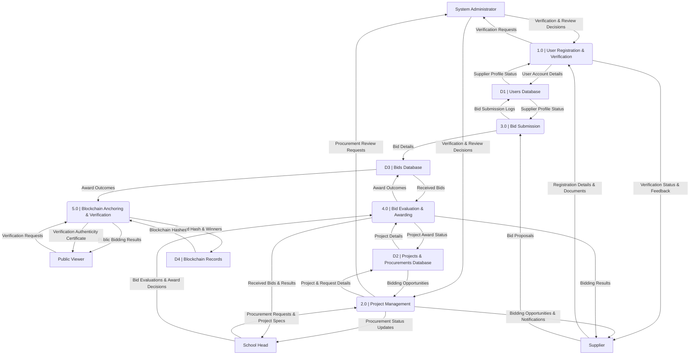

PROCURECHAIN: A BLOCKCHAIN-BASED TRANSPARENT PROCUREMENT BIDDING SYSTEM

Presented to the
Institute of Computing
Davao del Norte State College
Panabo City, Davao del Norte

In Partial Fulfillment
of the Requirements for the Degree
BACHELOR OF SCIENCE IN INFORMATION TECHNOLOGY

JEFF MICO GUERRA
KURT JOHN PHILIP PACIA
KENTH CHARLES REOLLO

JUNE 2026

CHAPTER 1

INTRODUCTION

Background of Study

Procurement systems are important for ensuring fair competition, proper resource allocation, and efficient project implementation [1]. However, traditional procurement bidding systems are often centralized, making them vulnerable to data manipulation, limited transparency, and reduced stakeholder trust [2]. These issues may result in unfair bidding practices, delays, and reduced organizational credibility.
To address these challenges, organizations are adopting emerging technologies such as blockchain [3]. Blockchain provides decentralized and immutable record-keeping, allowing transactions to be stored securely and transparently. Unlike centralized databases, blockchain distributes records across multiple nodes, improving data integrity and reducing risks of unauthorized modification.
Studies show that blockchain improves trust, transparency, traceability, and fraud prevention in transactional systems [4]. It also supports transparent audit trails and tamper-proof recording of procurement activities, promoting accountability throughout the procurement process.
Blockchain systems also use smart contracts to automate predefined rules and agreements [5]. Smart contracts reduce manual intervention, minimize human error, and improve transaction efficiency, making blockchain suitable for procurement environments that require fairness, security, and transparency.
Web-based and e-procurement systems have improved accessibility and efficiency in procurement processes [6]. Suppliers can participate remotely, and organizations can streamline bid submission and evaluation. However, many systems still rely on centralized databases, which remain vulnerable to cyber threats, unauthorized modification, and lack of immutability.
In the Philippines, procurement activities are governed by Republic Act 9184 or the Government Procurement Reform Act, which promotes transparency and accountability in government procurement [7]. Despite this, challenges remain in bid evaluation, result verification, and record management, highlighting the need for more secure and transparent procurement technologies.
Overall, existing procurement systems improve efficiency but still lack strong mechanisms for trust, transparency, and tamper-proof record management [8]. Blockchain technology addresses these limitations through decentralized verification, secure storage, and immutable transaction records.
Thus, this study proposes the development of a Blockchain-Based Transparent Procurement Bidding System that integrates bid submission, evaluation, and immutable recording of awarded bidders to ensure transparency, security, accountability, and trust in procurement processes [9].

Objectives of the Study
The study aims to develop a Blockchain-Based Transparent Procurement Bidding System that enhances transparency, security, accountability, and efficiency in procurement processes through web-based bidding and blockchain-based verification. 
Develop a web-based procurement platform that allows administrators to create and manage procurement requests, projects, bidding activities, supplier information, and procurement records. 
Implement a supplier and online bidding management system that enables supplier registration, document verification, secure bid submission, uploading of supporting documents, timestamp recording, encryption of bid data, and automatic bid closure. 
Develop a bid evaluation and supplier ranking mechanism based on predefined procurement criteria such as technical compliance, eligibility requirements, bid amount, and evaluation scores to support fair and transparent decision-making. 
Integrate blockchain technology to securely record finalized procurement results, including project details, supplier information, bid amounts, timestamps, and cryptographic hash values to ensure transparency, immutability, and verifiable transaction records. 
Generate procurement reports, supplier activity reports, award histories, bid histories, audit logs, and public verification features to improve transparency, accountability, monitoring, and decision-making in procurement activities. 
To develop a result verification feature that enables users, stakeholders, and the public to validate procurement outcomes through blockchain records, providing a reliable method for confirming authenticity, preventing data manipulation, and strengthening trust in the bidding process.

Significance of Study
The proposed Blockchain-Based Transparent Procurement Bidding System is expected to provide significant benefits to various stakeholders by improving transparency, efficiency, and trust in procurement processes.
Organizations. Organizations will benefit from a more transparent and secure procurement system that minimizes risks of manipulation and enhances accountability in bidding activities. The system supports better decision-making and improves overall operational efficiency.
Administrators. Administrators will gain a centralized platform for managing procurement processes, including project posting, bid evaluation, and result generation. This reduces manual workload and improves accuracy and organization in handling procurement tasks.
Suppliers. Suppliers will benefit from a fair and transparent bidding environment where all submissions are properly recorded and evaluated. This promotes equal opportunity and increases confidence in the procurement system.
Users and the Public. The system enables verification of procurement results through blockchain technology, allowing greater transparency and public trust in procurement transactions.
Researchers. This study will serve as a reference for future research related to blockchain applications in procurement systems, transparency mechanisms, and secure information systems.

Scope and Limitation
This study focuses on the development of a Blockchain-Based Transparent Procurement Bidding System designed to improve transparency, security, accountability, and efficiency in procurement processes. The system is implemented as a web-based application accessible through desktop, laptop, and mobile web browsers. It allows administrators to create procurement requests, publish procurement projects, manage suppliers, evaluate bids, rank suppliers, select winning bidders, and generate procurement reports. Suppliers can register accounts, upload required documents, view procurement projects, and submit bids electronically.
The system includes input validation, bid evaluation, supplier ranking, audit logging, and report generation features to support reliable and organized procurement management. PostgreSQL is used for storing operational procurement data such as user accounts, procurement projects, bid submissions, evaluation results, and audit logs, while blockchain technology is integrated to record finalized procurement results, timestamps, and cryptographic hash values to ensure transparency, immutability, and verifiable audit trails. APIs are also utilized for communication between the frontend, backend server, and blockchain network. Security mechanisms such as user authentication, role-based access control, encrypted communication protocols, and monitoring are implemented to protect procurement data and system resources.
However, the study is limited only to procurement bidding management processes including project creation, supplier registration, bid submission, evaluation, supplier ranking, awarding, blockchain recording, public verification, and report generation. The system does not include inventory management, payment processing, delivery tracking, or financial accounting modules. The blockchain component is limited to recording finalized procurement results and verification data only, while regular operational data remains stored in a centralized PostgreSQL database for efficient transaction processing. The system also depends on internet connectivity because it operates as a web-based platform integrated with blockchain services and APIs. In addition, the study focuses only on authorized administrators, suppliers, and public viewers involved in procurement activities, and does not include large-scale government deployment or advanced procurement policy automation.

Review of Related Literature and Works
Related Literature
	Procurement systems play a critical role in organizational operations, especially in ensuring fair competition, accountability, and efficient allocation of resources. However, traditional procurement processes often rely on centralized architectures that are vulnerable to manipulation, lack of transparency, and inefficiencies in audit trails [1], [2]. These limitations have led to growing interest in decentralized technologies that can improve trust and data integrity in procurement environments.
Blockchain technology has emerged as a leading solution to address trust and transparency issues in digital systems. Nakamoto [3] introduced blockchain as a decentralized ledger system that ensures data immutability and eliminates the need for a central authority. Crosby et al. [4] further explained that blockchain provides a tamper-resistant structure where recorded data cannot be altered without network consensus, making it suitable for sensitive applications such as procurement bidding systems.
In addition, blockchain enhances transparency through distributed validation mechanisms. Christidis and Devetsikiotis [5] highlighted that blockchain combined with smart contracts enables automated execution of rules without human intervention. Smart contracts ensure that predefined conditions are met before executing actions such as awarding bids, reducing bias and human error [6], [7].
Security and data integrity are also key strengths of blockchain systems. Yli-Huumo et al. [8] emphasized that blockchain research consistently shows improvements in auditability and traceability of transactions. These characteristics are essential in procurement systems where verifying bid history and awarded contracts is necessary for accountability.
Smart contracts further enhance automation in procurement workflows. According to Szabo [9], smart contracts are self-executing protocols that enforce agreement rules automatically. Ethereum-based implementations demonstrate how smart contracts can be used to automate bidding processes, ensuring fair execution of procurement rules [10].
Web-based procurement systems have also been widely implemented to digitize bidding processes. Buyya et al. [11] explained that web and cloud-based platforms improve accessibility and scalability by enabling remote participation in online systems. However, these systems still rely on centralized databases that are susceptible to unauthorized modification and lack immutability [12], [13].
E-procurement systems improve efficiency by reducing manual processes in bid submission and evaluation. Chen et al. [14] noted that digital procurement platforms streamline workflows but still face challenges in transparency and trust due to centralized data storage. Similarly, Boehm [15] emphasized that while digital procurement improves speed, it does not fully eliminate risks of data tampering.
In government procurement systems, transparency is a critical requirement. The Government Procurement Policy Board (GPPB) under RA 9184 ensures competitive bidding and accountability in public procurement [16]. However, implementation gaps still exist, especially in digital systems where full traceability and verification of results are limited [17].
Cloud computing has also contributed to the development of scalable procurement systems. Marston et al. [18] explained that cloud platforms enable flexible access and centralized data management. However, Ranjan [19] noted that cloud systems still rely on trusted third-party servers, which may introduce risks related to data control and security.
Blockchain applications in supply chain and procurement systems have gained significant attention in recent years. Treiblmaier [20] highlighted that blockchain improves supply chain transparency by enabling traceable and verifiable records. Saberi et al. [21] further emphasized that blockchain enhances trust among stakeholders by reducing fraud and improving accountability.
Studies also show that blockchain improves public sector transparency. Kshetri [22] explained that blockchain adoption in government systems reduces corruption risks by ensuring immutable record-keeping. Kumar et al. [23] further stated that blockchain-based public systems improve trust in administrative processes.
Hybrid systems combining blockchain and web technologies have been proposed to improve usability and security. Reyna et al. [24] discussed that integrating blockchain with IoT and web systems enhances data reliability and automation. Di Pierro [25] added that such hybrid models provide both user-friendly interfaces and secure backend structures.
Traceability systems using blockchain have been applied in various domains. Tian [26] demonstrated that blockchain-based traceability systems improve transparency in complex supply chains. These findings support the use of blockchain in procurement systems where bid history tracking is essential.
Furthermore, blockchain adoption studies show increasing interest in decentralized procurement platforms. Korpela et al. [27] emphasized that blockchain improves operational efficiency and reduces reliance on intermediaries. Swan [28] also highlighted blockchain’s role in transforming business processes through decentralized trust systems.
Finally, blockchain-based procurement systems continue to evolve toward full automation and verification. Pilkington [29] noted that blockchain enables secure digital governance systems. Li et al. [30] concluded that blockchain adoption in industrial systems improves reliability, transparency, and data integrity.

Related Works
	Traditional Procurement Systems support basic procurement functions such as bid submission and evaluation through centralized management [1]. These systems improve transaction handling and procurement organization but lack transparency and secure record verification. Web-Based Procurement Systems improve accessibility by allowing suppliers to participate remotely and submit bids online [11]. E-Procurement Platforms further enhance efficiency by digitizing procurement workflows, reducing manual processing, and simplifying administrative tasks [14]. These features are useful in developing a more accessible and efficient procurement environment for the proposed system.
Blockchain Transaction Systems contribute secure and immutable record management through decentralized ledgers, ensuring that stored transactions cannot be altered [4]. This feature is important for maintaining transparency and preventing unauthorized modification of procurement records. Smart Contract Systems provide automated execution of predefined rules, reducing manual intervention and improving transaction efficiency [10]. These mechanisms are beneficial for automating bid evaluation and procurement verification processes. In addition, Supply Chain Blockchain Systems demonstrate how blockchain improves transparency, traceability, and decentralized verification of transactions [20]. These capabilities support the development of a transparent and verifiable procurement bidding process.
The proposed Blockchain-Based Transparent Procurement Bidding System integrates the useful features of existing systems, including web-based accessibility, digital procurement workflows, blockchain-based immutable records, smart contract automation, and transparent verification mechanisms. By combining these technologies into a unified platform, the proposed system aims to improve transparency, security, accountability, and trust in procurement processes.

System
Bid
Submissi on
Evaluation
Transpar ency
Blockcha in Integratio n
Result Verificatio n
Centralize d Contro
Traditional Procurement System [1]
✓
✓

✓
Web-Based Procurement System [11]
✓
✓

✓
E-Procureme nt Platform [14]
✓
✓

✓
Blockchain Transaction System [4]

✓
✓
✓

Smart Contract System [10]
✓
✓
✓
✓
✓

Supply Chain Blockchain System [20]
✓

✓
✓
✓

Proposed System

✓
✓
✓
✓
✓
✓

Table 1. Comparison table of existing system vs. the proposed system.
	Compared to existing systems as shown in Table 1, the proposed system extends functionality by incorporating automated report generation and centralized monitoring, enabling both real-time detection and data-driven decision-making. It also focuses on campus-specific deployment, addressing the lack of localized implementations identified in previous studies. Additionally, the integration of hybrid algorithms enhances both detection accuracy and operational efficiency.

Definition of Terms
Blockchain. A decentralized digital ledger technology used in the system to store procurement records in a secure, immutable, and transparent manner where data cannot be altered once recorded.
Bid. A formal offer submitted by a supplier through the system in response to a posted procurement project, including proposed cost, timeline, and requirements compliance.
Bid Evaluation. The process of assessing and comparing submitted bids based on predefined criteria to determine the most suitable supplier for a procurement project.
Centralized System. A system architecture where data is stored and managed in a single database, which may be vulnerable to unauthorized changes compared to decentralized systems.
Decentralization. A system structure where data is distributed across multiple nodes, reducing reliance on a single authority and improving transparency and security.
E-Procurement. The use of digital platforms to conduct procurement processes such as project posting, bid submission, and awarding of contracts.
Immutability. A property of blockchain where recorded data cannot be modified, altered, or deleted once it has been stored in the ledger.
Procurement System. A digital platform used by organizations to manage purchasing activities, including project creation, supplier bidding, evaluation, and awarding.
Result Verification. A feature of the system that allows stakeholders to confirm and validate the awarded bidder through blockchain records to ensure transparency and authenticity.
Smart Contract. A self-executing digital agreement stored in the blockchain that automatically enforces rules and conditions such as bid evaluation and awarding processes.
Transparency. The ability of the system to provide clear, accessible, and verifiable information regarding procurement activities and results to all stakeholders.
Web-Based System. A software application that runs on a web browser, allowing users to access the procurement bidding system through the internet without installing local software.

CHAPTER 2

METHODOLOGY

The project adopts a Hybrid Project Management Methodology that combines the structured approach of Waterfall and the flexibility of Agile to effectively support the requirements of a capstone project as illustrated in Figure 1. The Waterfall approach is applied during the initial stages, particularly in planning, requirements definition, and documentation, ensuring that all outputs such as proposals and system designs are clearly defined and validated before development begins. Meanwhile, Agile practices are utilized during the implementation and testing phases, allowing iterative development, continuous testing, and incremental improvement of system features such as real-time monitoring, alert mechanisms, and report generation. This integration enables a balance between structure and adaptability, making it suitable for systems with both well-defined requirements and evolving components, such as AI functionalities and user interface enhancements.
The project begins with the Planning phase, where the proponents defined the project scope, objectives, timeline, and required resources based on the approved concept paper. During this phase, they also established the overall direction of the system and ensured its feasibility within the given timeframe. In the Analysis phase, the proponents gathered and finalized system requirements by reviewing existing procurement and bidding processes, identifying user needs, and determining both functional and non-functional requirements necessary for the system.
In the Design phase, the proponents translated these requirements into a structured system architecture, including the design of the database, user interface, and overall system flow, supported by diagrams and prototypes to visualize how the system will operate. During the Implementation phase, the proponents developed the system using an iterative approach, where coding, integration of IoT components, and testing were performed incrementally. This allowed them to refine features such as real-time monitoring, alert mechanisms, and automated reporting based on testing results.
Finally, in the Maintenance phase, the proponents conducted system evaluation, identified issues, and applied necessary improvements to enhance system performance and usability. Although limited within the project duration, this phase ensured that the system remains stable, reliable, and ready for future enhancements.

Figure 1. Integrated Hybrid Project Management Approach.

SYSTEM PLANNING
Project Team Organization
The system planning phase focuses on defining the overall direction, scope, and objectives of the Blockchain-Based Procurement Bidding System. In this phase, the proponents identified the need to develop a secure and transparent procurement platform that addresses the limitations of traditional bidding systems, such as lack of transparency, risk of bid manipulation, and inefficient manual processes. The planning stage establishes the foundation of the system by outlining its purpose, key features, and expected outcomes.
The primary objective of the system is to provide a structured and reliable platform that supports procurement activities, including user management, project creation, bid submission, evaluation, winner selection, and blockchain-based result recording. The system is designed to ensure that all procurement transactions are secure, traceable, and tamper-resistant, improving trust among administrators, suppliers, and viewers.
During this phase, the scope of the system was clearly defined to include only digital procurement processes within a web-based environment. The system is intended to support three main user roles: administrators, who manage projects and oversee procurement activities; suppliers, who participate in bidding by submitting proposals; and viewers, who access and verify procurement results. The planning phase also identified the integration of blockchain technology as a key component to ensure immutability of procurement records and enhance system transparency.
The resources required for system development were also determined during this phase. These include development tools, programming languages, database systems, and blockchain platforms necessary to build and implement the system. A timeline was established to guide the development process, ensuring that each phase, from analysis to implementation and testing, is completed within the project schedule.
Overall, the system planning phase ensures that the Blockchain-Based Procurement Bidding System is well-defined, feasible, and aligned with the objectives of the study. It serves as the foundation for subsequent phases, guiding the development of a secure, efficient, and transparent procurement platform.

Figure 2. Project Management Team Organization
Work Breakdown Structure
The Work Breakdown Structure (WBS) is a hierarchical decomposition of the tasks required to complete the Blockchain-Based Procurement Bidding System. It organizes the project into manageable components, allowing the proponents to systematically plan, execute, and monitor each stage of development. The WBS ensures that all activities, from initial planning to system deployment, are clearly defined and aligned with the objectives of the study.
For this capstone project, the WBS is designed to reflect the development of a secure and transparent procurement system that integrates blockchain technology into the bidding process. Each major phase corresponds to the system development methodology adopted in the study, ensuring that all technical and functional requirements are addressed efficiently.
The first component of the WBS is Project Initiation and Planning, which involves defining the system scope, objectives, and overall concept. In this stage, the proponents identified the key problems in traditional procurement systems, such as lack of transparency and risk of bid manipulation, and proposed the integration of blockchain technology as a solution. A project timeline and resource allocation were also established to guide the development process.
The second component is System Analysis, where detailed requirements of the system were gathered and analyzed. This includes identifying user roles such as administrators, suppliers, and viewers, and defining system functionalities such as project management, bid submission, evaluation, and result recording. This stage ensures that the system addresses real procurement challenges and meets user needs.
The third component is System Design, which focuses on creating the overall structure of the system. In this stage, diagrams such as the Data Flow Diagram (DFD), Entity Relationship Diagram (ERD), and Use Case Diagram were developed to represent system processes, data flow, and user interactions. The database structure and system interface were also designed to support efficient and user-friendly operations.
The fourth component is System Development and Implementation, where the actual system is built. This includes coding the core modules such as user management, project management, bid submission, evaluation, and blockchain integration. The blockchain component is implemented to ensure that procurement results are stored in an immutable ledger. Integration of all modules is performed to ensure smooth system operation.
The fifth component is System Testing, which involves verifying that all system functionalities work correctly. Test cases are conducted to simulate procurement scenarios, including bid submission, evaluation, and result recording. Errors are identified and corrected to improve system performance, security, and reliability.
The final component is Deployment and Maintenance, where the system is prepared for use and evaluated for performance and usability. Necessary improvements are applied based on testing results and user feedback. Although limited within the project timeframe, this phase ensures that the system remains stable and adaptable for future enhancements.

Figure 3. Work Breakdown Structure.

Gantt Chart
The Gantt chart in Figure 4 presents the timeline and schedule of activities for the development of the Blockchain-Based Bidding System. It illustrates the sequence and duration of each phase—from Requirement Analysis and System Design to System Development, Testing and Validation, and Deployment and Evaluation—ensuring that all key tasks such as identifying user requirements, designing the system architecture, developing the platform, testing smart contracts and system functionality, and deploying the system are completed within the specified timeframe. The chart helps the proponents monitor progress, manage time efficiently, and ensure that each phase is completed on schedule, supporting the successful and organized completion of the project.

Figure 4. Gantt Chart of the system.

SYSTEM ANALYSIS
System Architecture
The proposed Blockchain-Based Procurement Bidding System follows a structured multi-layer architecture designed to support secure, transparent, and efficient procurement processes. The architecture is composed of three main layers: the user interface layer, the application layer, and the data layer. These layers work together to ensure proper system functionality, data processing, and secure storage of procurement transactions.
The user interface layer serves as the front-end of the system, where users interact with the platform through a web-based environment. This layer allows administrators, suppliers, and viewers to access system features based on their assigned roles. Administrators can manage users and procurement projects, suppliers can view available projects and submit bids, and viewers can access procurement results. The interface is designed to be simple and user-friendly to ensure ease of navigation and efficient system use.
The application layer functions as the core processing unit of the system. It handles all system logic and operations, including user authentication, project management, bid submission, evaluation, and winner selection. This layer ensures that all procurement activities follow predefined rules and workflows. It also includes the integration of blockchain functionality, where finalized procurement results are processed and prepared for secure recording. The application layer ensures that all system modules interact properly and that data is processed accurately and consistently.
The data layer is responsible for storing and managing system data. It consists of a centralized database and a blockchain network. The centralized database stores information such as users, suppliers, projects, and bids, enabling efficient data retrieval and management. On the other hand, the blockchain network is used to store finalized procurement results, ensuring immutability and preventing data tampering. Once recorded in the blockchain, the results cannot be modified, providing a secure and transparent audit trail.
The interaction between these layers ensures a complete procurement workflow. Users initiate actions through the interface, which are processed by the application layer and then stored in the data layer. The integration of blockchain technology enhances system security by ensuring that critical records, particularly procurement results, remain permanent and verifiable.
Overall, the system architecture supports the objectives of the study by providing a reliable, secure, and transparent platform for procurement bidding. It ensures efficient system operation while maintaining data integrity and accountability across all stages of the procurement process.

Figure 5. System architecture of the project.

Functional and Non-functional Requirements
The functional and non-functional requirements define the expected capabilities and quality attributes of the proposed Blockchain-Based Procurement Bidding System. The functional requirements specify the core features of the system, including user management, project posting, bid submission, evaluation, winner selection, and blockchain-based result recording. Meanwhile, the non-functional requirements describe how well the system performs, focusing on aspects such as security, reliability, usability, and performance efficiency based on ISO/IEC 25010 standards. These requirements ensure that the system operates efficiently, maintains data integrity, and supports transparent and secure procurement decision-making.

	The system shall provide the following functionalities:
1. 	The system shall allow administrators, suppliers, and viewers to register and log in using secure authentication mechanisms.
2. The system shall allow administrators to create, update, and manage procurement projects, including project details such as requirements, budget, and deadlines.
3. The system shall allow suppliers to view available projects and submit bids through the system.
4. The system shall store submitted bids securely in a centralized database to ensure data integrity and proper record management.
5. The system shall process and evaluate submitted bids based on predefined criteria.
6. The system shall allow administrators to review bids, compare proposals, and select the most suitable supplier.
7. The system shall generate procurement results based on the selected winning bidder.
8. The system shall record finalized procurement results in a blockchain ledger to ensure immutability and transparency.
9. The system shall allow users to view and verify procurement results through the system interface.
10. The system shall maintain records of procurement activities for monitoring and audit purposes.
 
The following are the system’s non functional requirements:
1. Performance Efficiency. The system shall process user requests, bid submissions, and result generation within acceptable response time to ensure smooth operation. 
2. Reliability. The system shall ensure consistent performance and accurate handling of procurement data with minimal system errors or downtime.
3. Usability. The system shall provide a user-friendly interface that is easy to navigate for administrators, suppliers, and viewers..
4. Security. The system shall protect user data and procurement records through authentication, authorization, and secure data handling, including blockchain-based protection for results.
5. Compatibility. The system shall be accessible through web browsers across different devices such as desktops, tablets, and mobile devices.
6. Maintainability. The system shall be designed to support updates, Scalability (Portability/Adaptability). The system shall support an increasing number of users, projects, and bids without significant performance issues.
7. Availability. The system shall be accessible to authorized users whenever needed, provided stable internet connectivity is available.

Use Case Diagram 
The primary users as shown in Figure 6, identified in the system are the System Administrator, the School Head (Procuring Entity), and the Supplier. The System Administrator is responsible for managing and maintaining the system, including verifying supplier documents, managing user accounts, and monitoring audit logs. These interactions ensure that the system operates according to the defined parameters and remains aligned with user requirements. The administrator provides verification status, user management controls, and system configurations to the system, which is then processed and stored for system operation.
On the other hand, the School Head interacts with the system by creating procurement requests, publishing projects, evaluating bids, and awarding projects to winning suppliers. The Supplier interacts by registering, completing their profile, uploading legal and financial documents, viewing published projects, and submitting bids. The system processes bids, runs verification checks on supplier eligibility, anchors transaction hashes to the blockchain ledger, and notifies participants of updates, enabling transparency and accountability throughout the bidding process.

	
Figure 6. Use Case Diagram of the system.
Context Flow Diagram
The Context Flow Diagram shown in Figure __ presents a high-level view of the Blockchain-Based Procurement Bidding System. It illustrates how the system interacts with external entities and how data flows across the system. It focuses on the logical flow of procurement processes, highlighting key inputs, processes, and outputs without detailing the internal system structure.
In the diagram, the main external entities include the Administrator, Supplier, and Viewer. The Administrator serves as the primary controller of the system, responsible for managing users, creating and managing procurement projects, evaluating bids, and selecting the winning bidder. The administrator provides inputs such as user data, project details, evaluation criteria, and configuration data to the system. These inputs ensure that the procurement process is properly managed and aligned with organizational requirements.
The Supplier interacts with the system by participating in procurement activities. Suppliers receive project information and requirements from the system and submit bids as their primary input. These bids contain relevant proposal details, which are processed and evaluated within the system. The system then provides outputs to suppliers, including bid status updates and procurement results, allowing them to monitor the progress of their submissions.
The Viewer acts as an external entity that focuses on transparency and verification. The viewer can access project information and procurement results provided by the system. Additionally, the viewer may request verification of results, particularly those recorded in the blockchain. The system responds by providing verified and immutable records, ensuring transparency and trust in the procurement process.
The diagram also shows key data flows such as project data, bid submissions, evaluation data, and procurement results, which represent the essential interactions between the system and its external entities. One of the critical outputs of the system is the recording of finalized procurement results in the blockchain, ensuring that these records are secure, transparent, and tamper-resistant.
Overall, the Context Flow Diagram demonstrates how data is collected, processed, and transformed into meaningful outputs that support decision-making in procurement activities. It highlights the role of blockchain technology in enhancing transparency, accountability, and security within the system.

```mermaid
graph TD
    System("0.0 | ProcureChain System")
    Admin[System Administrator]
    SchoolHead[School Head]
    Supplier[Supplier]
    Viewer[Public Viewer]

    Supplier -->|Registration Details & Documents| System
    Supplier -->|Bid Proposals| System
    System -->|Verification Status & Feedback| Supplier
    System -->|Bidding Opportunities & Notifications| Supplier

    SchoolHead -->|Procurement Requests| System
    SchoolHead -->|Project Specifications| System
    SchoolHead -->|Bid Evaluations & Award Decisions| System
    System -->|Procurement Status Updates| SchoolHead
    System -->|Received Bids| SchoolHead
    System -->|Bidding Results| SchoolHead

    Admin -->|Admin Credentials| System
    Admin -->|Verification & Review Decisions| System
    System -->|Verification Requests| Admin
    System -->|System Logs & Alerts| Admin

    Viewer -->|Verification Requests| System
    System -->|Public Bidding Results| Viewer
    System -->|Verification Authenticity Certificate| Viewer
```

Figure 7. Context flow diagram of the system.

Data Flow Diagram
The Data Flow Diagram (DFD) illustrates the detailed flow of data within the Blockchain-Based Procurement Bidding System. It shows how data moves between external entities, system processes, and data storage, providing a clear representation of how procurement activities are executed within the system. The diagram highlights the transformation of inputs into outputs through a series of defined processes.
In the diagram, the main external entities include the Administrator, Supplier, and Viewer. The Administrator provides inputs such as user information, project details, evaluation data, and winner selection. The Supplier interacts with the system by submitting bids and receiving project information and results. The Viewer accesses procurement results and may request verification of recorded data. These entities serve as the primary sources and recipients of data within the system.
The system is composed of several key processes. Process 1.0, User and Project Management, handles the creation and management of user accounts and procurement projects. It receives input data from the administrator and stores it in the system database. Process 2.0, Bid Submission, allows suppliers to submit bids, which are then stored securely for evaluation. Process 3.0, Bid Evaluation, processes submitted bids based on predefined criteria and prepares the data for decision-making. Process 4.0, Winner Selection, enables the administrator to select the most suitable supplier based on evaluation results. Process 5.0, Blockchain Recording, records the finalized procurement results in a blockchain ledger to ensure immutability and transparency.
The system also includes a central data store, labeled as D1 (System Database), which stores user data, project information, submitted bids, and evaluation results. This data store ensures that all procurement-related data is organized and accessible for processing. Additionally, the blockchain serves as a secondary data store for finalized results, ensuring that critical records are secure and tamper-resistant.
Data flows within the system include user data, project details, bid submissions, evaluation data, and procurement results. These flows demonstrate how information is collected from users, processed through system functions, and stored for future access and verification. Outputs such as bid status, evaluation results, and final procurement outcomes are provided to users, ensuring transparency and accountability.
Overall, the Data Flow Diagram presents a clear view of how the system processes procurement data, from initial input to final output. It emphasizes the integration of blockchain technology in securing procurement results and highlights the system’s ability to support efficient, transparent, and reliable bidding processes.

 Figure 8. Data flow diagram of the system.

### Data Flow Diagram Syntax and Semantic Rules
To ensure the correctness and logical consistency of the system's Data Flow Diagrams (Context Flow Diagram and Level 0 DFD), the system design and evaluation adhere to the following formal syntax and semantic rules:

#### 1. Syntax Rules (Connections and Components)
- **External Entities (Rule 9):** Data flows cannot directly connect one external entity to another. All communication between entities must pass through a system process.
- **Data Stores (Rule 10):** Data flows cannot directly connect an external entity to a data store, or a data store to another data store. Data must be read from or written to a data store by a process.
- **Process I/O (Rule 2):** Every process must have at least one input data flow and at least one output data flow. A process cannot be a "black hole" (inputs only) or a "miracle" (outputs only).
- **Flow Direction:** Data flows are unidirectional and represent the movement of data in one direction.

#### 2. Semantic and Consistency Rules (Balancing)
- **Viewpoint Consistency (Rule 5):** There must be a consistent viewpoint for the entire set of DFDs.
- **Decomposition (Rule 6):** Every parent process in a higher-level DFD must be fully and completely described by its child processes in lower-level DFDs.
- **Balancing/Equivalence (Rule 7):** Every data flow, data store, and external entity on a higher-level DFD must be preserved on the lower-level DFD that decomposes it. For example, if a data flow `bid submissions` connects `Supplier` to the system in the Context Diagram, the same flow must connect `Supplier` to the corresponding process (e.g., Process 2.0 Bid Submission) in the Level 0 DFD.
- **Data Store Access (Rule 8):** Data cannot move directly from one data store to another; a process must read the data, perform a transformation, and write it to the target store.

SYSTEM DESIGN
Entity Relationship Diagram
The Entity Relationship Diagram (ERD) presents the logical structure of the database for the Blockchain-Based Procurement Bidding System. It illustrates the entities involved in the system, their attributes, and the relationships between them. The ERD ensures proper organization of data, supports efficient data management, and maintains data integrity throughout the procurement process.
In the diagram, the main entities include User, Project, Bid, Evaluation, Result, and Blockchain Record. The User entity stores information about system users, including administrators, suppliers, and viewers. Each user has attributes such as user ID, name, email, password, and role, which determine their access and responsibilities within the system.
The Project entity contains details about procurement projects created by the administrator. Each project includes attributes such as project ID, title, description, budget, and deadline. A project is managed by an administrator and is associated with multiple bids submitted by suppliers.
The Bid entity represents the proposals submitted by suppliers for specific projects. It includes attributes such as bid ID, bid amount, proposal details, submission date, and status. Each bid is linked to one project and one supplier, establishing a many-to-one relationship between bids and projects, and bids and users.
The Evaluation entity stores the assessment of submitted bids based on predefined criteria. It includes attributes such as evaluation ID, score, remarks, and evaluation date. Each evaluation is associated with a specific bid, allowing the system to compare and analyze proposals effectively.
The Result entity contains the finalized outcome of the procurement process. It includes attributes such as result ID, selected bidder, and decision date. This entity represents the winning bid selected by the administrator after evaluation.
The Blockchain Record entity stores the immutable record of finalized procurement results. It includes attributes such as record ID, transaction hash, timestamp, and result reference. This ensures that procurement results are securely stored and cannot be modified.
The relationships between these entities define the system structure. A User (administrator) creates multiple Projects, while a User (supplier) can submit multiple Bids. Each Project can have many Bids, but each Bid belongs to only one Project. Each Bid can have one Evaluation, and each Evaluation leads to one Result. Each Result is recorded in the Blockchain Record, ensuring transparency and data integrity.
Overall, the ERD provides a clear representation of how data is structured and related within the system. It supports the implementation of a reliable database that ensures efficient procurement processing, secure data storage, and transparent record management.

Figure 9. Entity relationship diagram of the system.

JSON Schema Diagram
Figure 10 shows that JSON schemas are used to represent key data components of the Blockchain-Based Procurement Bidding System, such as user information, project details, bid submissions, evaluation data, procurement results, and blockchain records. For instance, the user schema defines required fields such as user ID, name, email, password, and role, along with their corresponding data types. Similarly, the project schema specifies attributes such as project ID, title, description, budget, and deadline, ensuring that all procurement projects follow a consistent data structure.
The bid schema defines the structure of supplier submissions, including bid ID, project reference, supplier ID, bid amount, proposal details, and submission timestamp. In addition, the evaluation schema outlines how bids are assessed, including score, remarks, and evaluation date. The result schema represents the finalized procurement outcome, including the selected bidder and decision date, while the blockchain record schema defines fields such as transaction hash, block number, timestamp, and network used for storing immutable records.
The diagram also illustrates validation rules such as required fields, data types, and formatting standards. These rules ensure that all user inputs, project data, and bid submissions are properly validated before being processed by the system. This reduces errors, prevents invalid or incomplete data entry, and improves overall system reliability.
Moreover, the use of JSON Schema supports interoperability between different components of the system. Since the platform operates through web-based services and may integrate with external blockchain networks, having a standardized data format ensures seamless communication between system modules. This allows efficient data exchange, consistent processing, and secure handling of procurement information throughout the system lifecycle.

Figure 10. JSON Schema Diagram.
Data Dictionary
TThe Data Dictionary presents a detailed description of all data elements used in the proposed Blockchain-Based Procurement Bidding System, serving as a reference for the system’s database structure and data organization. It defines the tables, fields, data types, and descriptions to ensure consistency, accuracy, and proper understanding of how data is stored and managed within the system. This section is essential in guiding the implementation of the database and supporting system development, maintenance, and future enhancements.
Table __ provides an overview of all the database tables utilized in the system, such as Users, Projects, Bids, Evaluations, Results, Blockchain Records, Notifications, and Audit Logs. Each table represents a specific data component necessary for system functionality. For instance, the Users table contains account and role information for administrators, suppliers, and viewers, while the Projects table stores procurement project details including requirements, budget, and deadlines.
The Bids table contains supplier submissions, including bid amounts, proposals, and submission timestamps. The Evaluations table stores the assessment results of each bid, including scores and remarks used in decision-making. The Results table records the finalized procurement outcomes, including the selected supplier and decision date. Additionally, the Blockchain Records table stores immutable transaction data such as transaction hash, block number, and timestamp, ensuring transparency and data integrity.
Other supporting tables include Notifications, which manage system alerts and messages for users, and Audit Logs, which track system activities and user actions for monitoring and accountability. These tables ensure that all system operations are properly recorded and traceable.
Subsequent tables present the detailed structure of each database component, including field names, data types, constraints (such as primary keys and foreign keys), and descriptions. These tables clearly define how each data element is used within the system. For example, the Bids table includes fields such as bid_id, project_id, supplier_id, bid_amount, and submitted_at, which are essential for managing procurement submissions.
Overall, the Data Dictionary ensures that all data elements within the system are well-defined, organized, and consistent. It supports efficient database design, accurate data processing, and reliable system performance throughout the procurement lifecycle.

Column
Data Type
Constraints
Description
id
UUID
PK, auto-generated
Unique user identifier
full_name
VARCHAR(255)
NOT NULL
User's full name
email
VARCHAR(255)
NOT NULL, UNIQUE
Login email address
password_hash
VARCHAR(128)
NOT NULL
Bcrypt-hashed password
role
VARCHAR(20)
DEFAULT 'supplier'
User role: admin, supplier, staff
status
VARCHAR(20)
DEFAULT 'pending'
Account status: pending, approved, rejected, active, inactive
company_name
VARCHAR(255)
DEFAULT ''
Supplier's company name
company_address
VARCHAR(255)
DEFAULT ''
Company physical address
phone
VARCHAR(50)
DEFAULT ''
Contact phone number
business_type
VARCHAR(100)
DEFAULT ''
Type of business (e.g., Sole Proprietor, Corporation)
representative_name
VARCHAR(255)
NULLABLE
Authorized representative name
tin
VARCHAR(50)
NULLABLE
Tax Identification Number
company_profile
TEXT
NULLABLE
Description of the company
business_permit_document
TEXT
NULLABLE
File path/URL of business permit
philgeps_registration
TEXT
NULLABLE
File path/URL of PhilGEPS registration
tax_clearance
TEXT
NULLABLE
File path/URL of tax clearance
valid_id
TEXT
NULLABLE
File path/URL of valid ID
supporting_documents
TEXT
NULLABLE
File path/URL of additional documents
verification_status
VARCHAR(20)
DEFAULT 'pending'
Document verification: pending, verified, verification_rejected
verified_at
TIMESTAMP
NULLABLE
When documents were verified
verified_by_id
UUID
NULLABLE, FK → users.id
Admin who verified the documents
verification_notes
TEXT
NULLABLE
Notes from verification review
is_staff
BOOLEAN
DEFAULT false
Staff flag
is_active
BOOLEAN
DEFAULT true
Whether account is active
is_superuser
BOOLEAN
DEFAULT false
Superuser flag
last_login
TIMESTAMP
NULLABLE
Last login timestamp
created_at
TIMESTAMP
DEFAULT now()
Account creation date
updated_at
TIMESTAMP
Auto-updated
Last modification date

Table 2. Name of table

Column
Data Type
Constraints
Description
id
UUID
PK, auto-generated
Unique project identifier
procurement_request_id
UUID
NULLABLE, UNIQUE, FK → procurements.id
Linked procurement request
title
VARCHAR(255)
NOT NULL
Project title
budget
DECIMAL(15,2)
NOT NULL
Approved budget for the project
deadline
DATE
NOT NULL
Bid submission deadline
procurement_schedule
DATE
NULLABLE
Scheduled procurement date
public_result_expiry_date
DATE
NULLABLE
When public results expire
requirements
TEXT
DEFAULT ''
Project requirements description
procurement_type
VARCHAR(50)
DEFAULT 'Services'
Type: Services, Goods, Infrastructure
delivery_period
INT
DEFAULT 0
Delivery period in days
technical_specifications
TEXT
DEFAULT ''
Technical specs for bidders
status
VARCHAR(20)
DEFAULT 'draft'
Status: draft, published, closed, awarded
is_archived
BOOLEAN
DEFAULT false
Whether project is archived
archived_at
TIMESTAMP
NULLABLE
When project was archived
archived_reason
VARCHAR(255)
NULLABLE
Reason for archiving
published_at
TIMESTAMP
NULLABLE
When project was published for bidding
awarded_at
TIMESTAMP
NULLABLE
When winning bid was awarded
created_by_id
UUID
NULLABLE, FK → users.id
Admin who created the project
created_at
TIMESTAMP
DEFAULT now()
Creation date
updated_at
TIMESTAMP
Auto-updated
Last modification date

Table 3. Name of table

Technologies, Concepts, and Theories
This section presents the key technologies and concepts used in the development of the proposed ProcureChain system. It explains the processes involved in handling procurement activities, from project creation and bid submission to bid evaluation, blockchain recording, and procurement verification, ensuring a secure, transparent, and efficient procurement workflow.
Data Collection
Data collection in the ProcureChain system is performed through user interaction with the web-based procurement platform. Administrators create procurement projects and input project details such as project title, procurement requirements, approved budget, submission deadlines, and procurement schedules. Suppliers submit bids together with proposal details, bid amounts, and supporting procurement documents.
In addition to user-provided data, the system generates operational data such as bid evaluation results, blockchain transaction records, procurement histories, verification logs, and audit trails. These data elements are essential for procurement monitoring, transparency, accountability, and system management.
Data Validation and Pre-Processing
Data validation and pre-processing are critical steps in preparing procurement information for processing and evaluation. The system validates all submitted inputs to ensure completeness, accuracy, and consistency of procurement data. Validation mechanisms check required fields, bid deadlines, supplier eligibility requirements, acceptable bid formats, and completeness of procurement documents.
Pre-processing also includes filtering duplicate submissions, handling incomplete records, formatting numerical values, and standardizing procurement-related data. These processes reduce errors, prevent invalid transactions, and improve the reliability and integrity of procurement operations.
Bid Evaluation and Supplier Ranking
The ProcureChain system applies a bid evaluation and supplier ranking mechanism to analyze submitted proposals based on predefined procurement criteria. These criteria may include bid amount, technical compliance, supplier qualifications, completeness of requirements, and overall proposal quality.
The system allows administrators to review submitted bids, compare supplier proposals, assign evaluation scores, and select the most suitable supplier for the procurement project. Evaluation results are securely stored within the system and linked to corresponding procurement records to maintain transparency and accountability throughout the procurement process.
Role-Based Access Control
The system implements a role-based access control mechanism to enforce procurement-level permissions and security. Unlike open-access systems, users are only allowed to access system functions based on their assigned roles. Administrators manage procurement projects, suppliers submit bids and procurement documents, while viewers are limited to procurement verification and result viewing.
This approach ensures that procurement data remains secure and accessible only to authorized users. It also supports accountability, confidentiality, and proper management of procurement activities within the system.
Cryptographic Hashing
Cryptographic hashing is used to generate a unique and fixed-length digital representation of finalized procurement records and blockchain transactions. The generated hash serves as the digital fingerprint of the procurement result.
The hash is computed based on procurement transaction data, ensuring that any modification to procurement records produces a completely different hash value. This property allows the system to detect tampering and maintain procurement data integrity.
Blockchain Anchoring for Procurement Integrity
Blockchain technology is utilized to store procurement result hashes within a decentralized and immutable blockchain ledger. This process, known as blockchain anchoring, ensures that once a procurement result hash is recorded, it cannot be altered without detection.
The blockchain serves as a trusted reference for verifying procurement integrity and provides a transparent audit trail for procurement validation purposes. This strengthens public trust, accountability, and transparency within the procurement process.
Procurement Verification and Audit Trail
The system verifies procurement authenticity by comparing procurement result hashes with the corresponding hashes stored on the blockchain. If the values match, the procurement result is considered authentic and unchanged. Otherwise, the procurement record is flagged as modified or invalid.
Verification results are recorded within the system logs to support traceability, monitoring, and auditing. Audit trails help administrators, suppliers, stakeholders, and public viewers verify procurement activities and procurement outcomes while ensuring accountability and transparency throughout the procurement lifecycle.

Technologies Used in the System
This section presents the key technologies utilized in the development of the proposed ProcureChain system. These technologies support procurement management, bid submission, supplier evaluation, blockchain-based verification, cryptographic hashing, audit logging, and web-based accessibility. The selected technologies were evaluated based on accuracy, performance, speed, cost, benchmark capability, scalability, integration complexity, and suitability to the objectives of the proposed system. 

Blockchain Technology
Blockchain technology is integrated into the Blockchain-Based Procurement Bidding System to support procurement transparency, result verification, and tamper-resistant recordkeeping. After the procurement evaluation process is completed and a winning bidder is selected, the system records the finalized procurement result on the blockchain. Instead of storing complete procurement files and supplier documents on-chain, the system stores only essential procurement result records and cryptographic references. This approach helps maintain document confidentiality while ensuring transparency, immutability, and verification of procurement decisions.
The selected blockchain platform for the system is Ethereum. Ethereum is a decentralized blockchain platform that supports smart contracts and secure transaction recording. It is widely used for decentralized applications and provides a transparent and immutable environment for storing critical system records. Ethereum is suitable for the Blockchain-Based Procurement Bidding System because the system requires transparent recording of finalized procurement outcomes, secure verification of bidding results, and smart contract support for future automation of procurement rules.

 Feature / Factor 
Ethereum 
Hyperledger Fabric 
Polygon PoS 
Binance Smart Chain (BSC) 
Mainnet / Network Availability 
Public mainnet available 
Private / permissioned deployment 
Public blockchain network 
Public blockchain network 
Smart Contract Support 
Strong Solidity and EVM smart contract support 
Supports chaincode / enterprise smart contracts 
EVM-compatible smart contracts 
EVM-compatible smart contracts 
Transaction Cost / Gas Fees 
Moderate to high gas fees depending on network traffic 
No public gas fees but requires infrastructure setup 
Lower fees than Ethereum 
Lower transaction fees 
Security 
Highly secure and decentralized 
Strong enterprise-level security 
Secure Ethereum scaling network 
Secure validator-based system 
Transparency 
Fully transparent and publicly verifiable 
Limited transparency depending on permissions 
Publicly transparent 
Publicly transparent 
Ease of Integration 
Large developer ecosystem and documentation 
More complex setup and maintenance 
Easy integration for Ethereum developers 
Easy integration for EVM developers 
Scalability 
Moderate scalability 
High scalability in private systems 
High scalability 
High scalability 
Suitability for Procurement System 
Highly suitable for procurement result recording and verification 
Suitable for private institutional procurement 
Suitable alternative for lower-cost deployment 
Suitable for cost-efficient blockchain implementation 
Reason for Selection 
Selected because it provides transparency, immutability, decentralized verification, and strong smart contract support for procurement result recording 
Not selected due to higher setup complexity 
Not selected because Ethereum provides stronger adoption and ecosystem support 
Not selected because Ethereum is more widely adopted for smart contract applications 

Table 7. Comparison of Blockchain Platforms / Technologies 

Web-Based System Architecture
The system is implemented as a web-based application, allowing users to access its features through standard web browsers. This architecture supports accessibility across different devices such as desktops, laptops, and mobile devices. It provides user interfaces for project management, bid submission, evaluation, and result viewing, ensuring ease of use and centralized system control.
PostgreSQL
PostgreSQL is used as the relational database management system for storing and managing structured operational data. It stores user accounts, project records, bid submissions, evaluation results, audit logs, and other transactional data. PostgreSQL is important because it provides reliable data storage, strong consistency, and support for primary and foreign keys, which helps maintain data integrity. It is used for high-frequency transactional operations, while blockchain is reserved only for finalized and permanent records.

Application Programming Interfaces (APIs)
APIs are used to enable communication between different components of the system, including the frontend interface, backend server, and blockchain network. APIs facilitate data exchange, allowing the system to process user inputs, retrieve stored data, and record transactions on the blockchain efficiently.

The main APIs used in the system include:
Authentication API for logging in users and issuing access tokens
Projects API for creating, listing, updating, and viewing procurement projects
Bids API for submitting bids, reviewing submitted bids, and selecting winners
Blockchain API for recording finalized procurement results
Dashboard API for retrieving summary statistics and reports
These APIs are used because they separate the user interface from business logic, improve security, and allow different parts of the system to communicate efficiently.
1                                                                                                           1
 JSON Data Format
The system utilizes JSON (JavaScript Object Notation) as a standard format for data exchange. JSON is lightweight, easy to read, and compatible with web-based systems, making it ideal for transmitting data between system components. It is also used in defining structured schemas for validating input data.
Security Technologies
To ensure system security, several mechanisms are implemented. These include user authentication, role-based access control, and encrypted communication using secure protocols such as HTTPS. These measures protect sensitive procurement data, prevent unauthorized access, and ensure that all transactions are conducted securely.

SYSTEM TESTING AND IMPLEMENTATION
	The system testing and implementation phase ensures that the Blockchain-Based Transparent Procurement Bidding System operates correctly and meets all functional requirements. Testing validates the user registration, document upload and validation, bid submission, bid evaluation, supplier ranking, blockchain anchoring, and report generation modules.
Performance evaluation is conducted using metrics such as page load times, database query execution, transaction processing speed, and API response times to ensure reliable system operation. Test cases simulate user actions, registration with various document uploads (including expired or invalid files), bid submission under valid and invalid conditions (blocking unverified suppliers), winner selection, and blockchain hash verification to confirm tamper detection.
A summary of test results is presented in tabular form to evaluate system performance across key components such as authentication, document verification, bid management, evaluation, blockchain recording, and reporting. This ensures that all modules function as expected.
A System Test Plan is prepared to define objectives, scope, test environment, test cases, and acceptance criteria, ensuring structured and systematic validation.
After testing, system deployment is performed by setting up the database on Supabase PostgreSQL, configuring environment variables, deploying the Next.js application, and integrating the blockchain hash verification functionality. Final validation is conducted in the staging environment, followed by user training for administrators, school heads, and suppliers.
Continuous monitoring is implemented to evaluate system performance, identify areas for improvement, and monitor blockchain recording success rates, ensuring long-term reliability and effectiveness in e-procurement management.

SYSTEM MAINTENANCE
The System Maintenance phase focuses on ensuring the continuous operation, reliability, and improvement of the Blockchain-Based Procurement Bidding System after deployment. This phase involves monitoring system performance, identifying and resolving issues, and implementing updates to enhance system functionality, security, and usability.
Maintenance activities include regular system monitoring, updating software components, optimizing database performance, and improving system features based on user feedback. In addition, blockchain-related components are monitored to ensure proper transaction recording, data integrity, and network reliability. Continuous evaluation is conducted to maintain system efficiency and support future enhancements.

System Security Plan
To ensure the protection of procurement data and system resources, a comprehensive System Security Plan is implemented. The system enforces user authentication and role-based access control to restrict unauthorized access. Data transmitted between the client, server, and blockchain network is secured using encrypted communication protocols, while stored data is protected through encryption and regular backup mechanisms.
Security measures also include input validation, audit logging, and continuous monitoring of system activities. These controls help prevent unauthorized actions, detect anomalies, and ensure accountability. Regular security assessments and updates are conducted to address vulnerabilities and maintain compliance with data protection standards.
Table 4 presents the System Security Plan aligned with ISO/IEC 27001 standards, ensuring that the system follows structured and internationally recognized security practices. These measures protect system data, maintain integrity, and ensure secure and reliable operation of the Blockchain-Based Procurement Bidding System.

Security Domain (ISO 27001)
Control Area
Description / Implementation in the System
A.5 Information Security Policies 
Security Policy
The system implements formal security policies to guide data protection, user access, and procurement processes. 
A.6 Organization of Information Security
Roles and Responsibilities
Roles such as Administrator and Supplier are defined with corresponding access privileges. 
A.9 Access Control
User Access Management
The system enforces role-based access control (RBAC), limiting access based on user roles. 
A.9 Access Control
Authentication Mechanism
Secure login with strong password policies and authentication mechanisms is implemented. 
A.10 Cryptography
Data Encryption
Data transmission is secured using encryption protocols such as HTTPS and TLS. Sensitive data is also encrypted in storage. 
A.12 Operations Security
Data Processing Integrity
Input validation and error handling ensure accuracy of procurement data and prevent system vulnerabilities. 
A.12 Operations Security
Logging and Monitoring
Audit logs track user activities, bid submissions, evaluations, and blockchain transactions. 
A.13 Communications Security
Network Security
Secure communication between client, server, and blockchain network is enforced using HTTPS and firewall configurations. 
A.11 Physical and Environmental Security
Device Protection
Servers and hosting environments are secured with restricted access and proper infrastructure controls. 
A.17 Information Security Aspects of Business Continuity
Data Backup and Recovery
Regular backups of database and system records ensure data recovery in case of failure. 
A.16 Information Security Incident Management
Incident Response
Procedures are established to detect, report, and respond to security incidents, including unauthorized access or data breaches. 
A.14 System Acquisition, Development, and Maintenance
Secure Development
Secure coding practices, validation checks, and regular updates are applied throughout system development and maintenance. 
A.18 Compliance
Legal and Regulatory Compliance
The system complies with data privacy regulations and institutional procurement policies. 

Table 4. System Security Plan

System Maintenance Plan
In addition, a System Maintenance Plan will be established to guide the continuous support, monitoring, and improvement of the Blockchain-Based Procurement Bidding System. This plan includes scheduled maintenance activities such as software updates, database optimization, security monitoring, and performance evaluation to ensure stable and efficient system operation.
Maintenance procedures also include troubleshooting system errors, fixing software bugs, monitoring blockchain transaction integrity, and updating system features based on user feedback and evaluation results. Documentation of all maintenance activities, updates, and system modifications will be maintained to support continuity, reliability, and future system enhancements.
The System Maintenance Plan presented in Table 5 aligns maintenance activities with ISO/IEC 25010 software quality standards. This ensures that the system remains reliable, secure, maintainable, and efficient throughout its operational lifecycle.

ISO 25010 Attribute
Maintenance Activity
Description
Frequency
Reliability
System Monitoring
Continuous monitoring of system uptime, bidding transactions, and blockchain records 
Daily
Performance Efficiency
Performance Optimization
Improving system response time, transaction processing, and database performance 
As needed
Usability
Interface Improvement
Updating user interface design and navigation based on user feedback 
Periodically
Security
Security Updates
Applying security patches, encryption updates, and vulnerability fixes 
Regularly
Maintainability
Code Refactoring & Debugging
Fixing bugs and improving system structure for easier maintenance and scalability 
As needed
Compatibility 
System Updates
Ensuring compatibility with browsers, devices, and operating environments 
Periodically
Reliability
Data Backup and Recovery 
Performing regular backups of procurement records and blockchain-related data 
Weekly 
Performance Efficiency
Database Optimization
Optimizing database indexing, storage, and query processing 
Weekly
Security 
Audit Log Monitoring 
Reviewing system logs and user activities to detect suspicious actions 
Daily 
Maintainability 
Documentation Update 
Updating technical documentation and maintenance records after system changes 
As Needed 

Table 5. System Maintenance Plan.

Reference
[1] 	S. Nakamoto, “Bitcoin: A Peer-to-Peer Electronic Cash System,” 2008.
[2] 	M. Crosby, P. Pattanayak, S. Verma, and V. Kalyanaraman, “Blockchain Technology: Beyond Bitcoin,” Applied Innovation Review, no. 2, pp. 6–19, 2016.
[3] 	K. Christidis and M. Devetsikiotis, “Blockchains and Smart Contracts for the Internet of Things,” IEEE Access, vol. 4, pp. 2292–2303, 2016.
[4]	 A. Dorri, S. S. Kanhere, and R. Jurdak, “Blockchain in Internet of Things: Challenges and Solutions,” IEEE Internet of Things Journal, vol. 6, no. 5, pp. 8076–8094, 2019.
[5] 	R. Buyya, C. S. Yeo, S. Venugopal, J. Broberg, and I. Brandic, “Cloud Computing and Emerging IT Platforms: Vision, Hype, and Reality,” Future Generation Computer Systems, vol. 25, no. 6, pp. 599–616, 2009.
[6] 	P. Mell and T. Grance, “The NIST Definition of Cloud Computing,” National Institute of Standards and Technology, 2011.
[7] 	L. Qian, Z. Luo, Y. Du, and L. Guo, “Cloud Computing: An Overview,” IEEE International Conference on Cloud Computing, 2009.
[8]	 S. Marston et al., “Cloud Computing — The Business Perspective,” Decision Support Systems, vol. 51, no. 1, pp. 176–189, 2011.
[9]	 R. Ranjan, “Cloud Data Management and Security Issues,” Future Generation Computer Systems, 2012.
[10]	 T. Boehm, “Digital Procurement Systems: Challenges and Opportunities,” Journal of Supply Chain Management, 2019.
[11] 	J. Chen, Y. Zhang, and X. Xu, “E-Procurement Systems and Digital Transformation,” International Journal of Information Management, 2020.
[12] 	Government Procurement Policy Board (GPPB), “Republic Act No. 9184: Government Procurement Reform Act,” Philippines, 2003.
[13]	 World Bank, “Enhancing Government Procurement through Digital Technologies,” World Bank Report, 2020.
[14]	 N. Szabo, “Smart Contracts,” 1997.
[15] 	G. Wood, “Ethereum: A Secure Decentralised Generalised Transaction Ledger,” 2014.
[16] 	J. Yli-Huumo et al., “Where Is Current Research on Blockchain Technology?—A Systematic Review,” PLOS ONE, 2016.
[17] 	H. Treiblmaier, “The Impact of Blockchain on Supply Chain,” Supply Chain Management: An International Journal, 2018.
[18]	 S. Saberi, M. Kouhizadeh, J. Sarkis, and L. Shen, “Blockchain Technology and Sustainable Supply Chain Management,” International Journal of Production Research, 2019.
[19] 	N. Kshetri, “Blockchain’s Role in Supply Chain Management,” International Journal of Information Management, 2018.
[20] 	A. Kumar, S. Liu, and A. Shan, “Blockchain in Public Sector Systems,” Government Information Quarterly, 2021.
[21]	 A. Reyna et al., “Blockchain and IoT Integration,” Future Generation Computer Systems, 2018.
[22]	  M. Di Pierro, “What Is the Blockchain?,” Computing in Science & Engineering, 2017.
[23] 	F. Tian, “Blockchain-Based Traceability System,” IEEE ICSSSM, 2016.
[24] 	K. Korpela, J. Hallikas, and T. Dahlberg, “Digital Supply Chain Transformation,” 2017.
[25]  	M. Swan, Blockchain: Blueprint for a New Economy. O’Reilly, 2015.
[26] 	 M. Pilkington, “Blockchain Technology: Principles and Applications,” 2016.
[27] 	 Y. Li, Y. Wu, and B. Chen, “Blockchain Applications in Industry Systems,” IEEE Access, 2020.
[28] 	D. Tapscott and A. Tapscott, Blockchain Revolution. Penguin, 2016.
[29] 	P. Mell and T. Grance, “Cloud Computing Definition,” NIST, 2011.
[30] 	G. Wood, “Ethereum Yellow Paper,” 2014.

